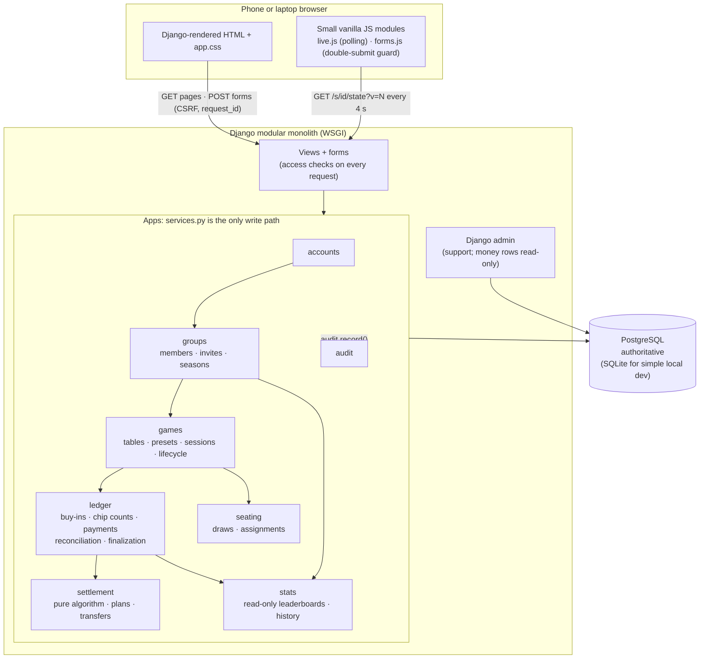
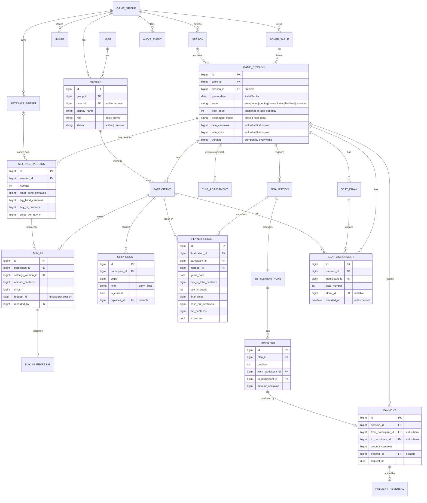
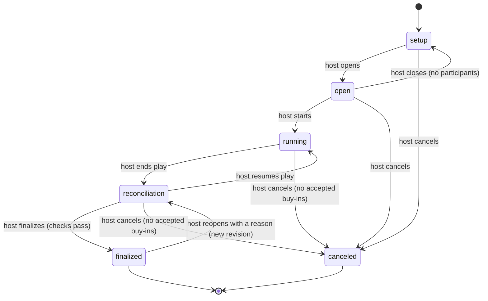

# Study: Poker home game architecture

- **Date:** 2026-10-03 22:23 (Asia/Manila), Unix timestamp `1791037419`
- **Request:** Design the architecture for a webapp that manages in-person poker home games. Complete Phase 1 only (study, then plan). Do not implement before approval.
- **Workflow:** `agentic-workflow`, Phase 1 (`study => plan => PAUSE FOR HUMAN APPROVAL`)
- **Plan:** `doc/plan/{timestamp}_poker_home_game_architecture.md` (written after this study)

Labels used in this document:

- **FACT** — verified by inspection on 2026-10-03.
- **REC** — recommendation. The human can change it.
- **ASSUMED** — not verified. It needs confirmation or it has a stated default.

---

## 1. Intended outcome

A home-game group has one reliable place to do these tasks:

1. Manage tables and dated game sessions.
2. Record buy-ins and rebuys.
3. Arrange seats.
4. Count chips, reconcile them, and calculate who pays whom.
5. Review player results across a season or a calendar year.

Priorities, in order: accurate accounting, simple host controls, clear mobile screens for players at the table.

Out of scope for the product: card dealing, betting engines, payment processing.

Acceptance criteria that a user can test from the outside are in the plan.

---

## 2. Current state

### 2.1 Target repository (FACT)

| Item | Finding |
|---|---|
| Path | `/Users/shm/PokerNights` |
| Contents | Empty directory at the start of this cycle |
| Git | Not a Git repository. No branch, no working changes |
| `AGENTS.md`, `CLAUDE.md` | None |
| `doc/canonical/`, wiki, active plans, `TODO.md` | None |
| Harness memory for this project | Empty |

**Limitation:** There is no repository. The study rule says "Do not initialize a repository under a study-only request". Thus this study and the plan are plain files. They are not committed. The plan proposes `git init` as the first Phase 2 task, after approval.

There is no unrelated work to preserve.

### 2.2 Local tools (FACT)

| Tool | Finding |
|---|---|
| Python | 3.14.8 at `/opt/homebrew/bin/python3` |
| PostgreSQL | 17.11 (Homebrew) is installed. The server was not running at inspection |
| Docker, `uv`, `gh` | Not installed |
| Git | `/usr/bin/git` |

### 2.3 LightChat reference (FACT)

Inspected at commit `2f5d10ad86f8e04e5a6b47ea0516b86d708b0927` on `main`. Files read: `requirements.txt`, `.python-version`, `.env.example`, `.gitignore`, `AGENTS.md`, `doc/wiki/README.md`, `doc/wiki/architecture.md`, `doc/wiki/setup.md`, `config/settings.py`, `config/deploy.py`, `config/urls.py`, `billing/models.py`, `billing/services.py`, `billing/money.py`, `billing/tests/test_concurrency.py`, `vercel.json`.

| Topic | LightChat today |
|---|---|
| Python | 3.14 (`.python-version`) |
| Pinned dependencies | `Django==6.1.1`, `django-environ==0.14.0`, `dj-database-url==3.1.2`, `psycopg[binary]==3.3.6` |
| Chat-only dependencies | `httpx`, `markdown-it-py`, `nh3` |
| Shape | One Django project. Apps: `config`, `accounts`, `billing`, `catalog`, `proxy`, `chat` |
| Front end | Templates in `templates/`, one stylesheet `static/css/app.css`, one vanilla script. No build step |
| Auth | Custom `accounts.User(AbstractUser)` as the first migration. `LoginRequiredMiddleware` protects all pages by default |
| Configuration | `environ.Env()` reads `.env`. `DATABASE_URL` goes through `dj_database_url.parse` in `config/deploy.py` |
| SQLite options | `transaction_mode=IMMEDIATE`, 20 s timeout, WAL. A file-backed test database |
| PostgreSQL options | `DISABLE_SERVER_SIDE_CURSORS = True` (PgBouncer transaction mode on Neon) |
| Time zone | `TIME_ZONE = "Asia/Manila"`, `USE_TZ = True` |
| Money | Integer units only. Conversion and formatting in `billing/money.py` with `Decimal` |
| Writes | A services module is "the only code allowed to change wallets". Short transactions. Append-only ledger. Read-only admin for ledger rows |
| Duplicates | A unique `(user, client_request_id)` constraint |
| Concurrency tests | `TransactionTestCase` with threads and a `threading.Barrier`. The suite runs on SQLite and on PostgreSQL with `DATABASE_URL=... manage.py test` |
| Access isolation | Every lookup is filtered by owner. Another user's object returns 404 |
| Deployment | Vercel (one Python function, WSGI) with Neon PostgreSQL. Tests run in the build |
| Docs | `doc/study/`, `doc/plan/`, `doc/wiki/` (`setup`, `architecture`, `features`, `external-dependencies`, `deployment`) |

PyPI check on 2026-10-03 (FACT): the four pinned versions above are the latest releases. All support Python 3.14.

### 2.4 Conventions to reuse and to leave (REC)

Reuse:

- The four baseline pins and Python 3.14.
- `config/` project package, custom user model first, login required by default.
- A services module per app as the only write path. Short transactions. Append-only money records. Read-only admin for them.
- Integer money with one `money.py` for conversion and display.
- Request IDs with unique constraints for duplicate protection.
- Threaded concurrency tests that run on both database engines.
- Owner-scoped lookups that return 404.
- The `doc/wiki/` page set.

Leave:

- `httpx`, `markdown-it-py`, `nh3`, the `proxy`, `catalog`, `chat` and `billing` apps, and the streaming endpoint.
- LightChat's filename format (`YYYY-MM-DD-HHMM-slug`). This project uses Unix timestamps and underscores, as `agentic-workflow` specifies.
- LightChat's extra approval stop after the study, its `AGENTS.md`/`CLAUDE.md` mirror rule, and its automatic scaffolding on every prompt. `agentic-workflow` states that these are local to LightChat.

### 2.5 Skills (FACT, then REC)

| Skill | Use in this cycle |
|---|---|
| `agentic-workflow` | Primary. It is installed at `~/.codex/skills/agentic-workflow/`, not in this harness's skill list. Its `SKILL.md` and three references were read and followed |
| `task-observer` | Loaded at session start as its description requires. No observation workspace exists on this machine. None was created, because the study stage permits one written file only |
| `impeccable` | Not used now. The request excludes decorative UI work in this cycle. REC: use it in the later UI pass, as LightChat does |
| Others (`dataviz`, `claude-api`, `security-review`, `code-review`) | Not applicable to Phase 1. `code-review` and `security-review` fit Phase 2 verification |

---

## 3. Options and tradeoffs

### 3.1 Application structure

| Option | Pros | Cons | Verdict |
|---|---|---|---|
| A. One Django project, several small apps (modular monolith) | Matches LightChat. One deploy, one database, plain transactions across modules | Module boundaries need discipline | **REC** |
| B. One Django app with all models | Least files | Accounting, seating and reporting mix. Hard to test the rules alone | No |
| C. API plus a separate front-end framework | Rich client state | Violates the baseline. Two codebases for a small app | No |

### 3.2 Settlement model

| Option | How it works | Pros | Cons |
|---|---|---|---|
| D. Direct settlement | No money moves during the game. After finalization, the app lists transfers between players | No cash-handling state during play. Least host data entry. Matches the worked example | More transfers at the end. Early leavers need a recorded payment or must wait |
| H. Host bank | The host collects each buy-in and pays each cash-out | Each player deals with one party. Natural when cash is on the table | The host must mark each buy-in paid or unpaid. The host carries the float. More taps during play |

**REC: start with D, and build the ledger so that H is the same formula with one more party.** Section 7.5 shows the formula. **This choice is flagged for confirmation** (plan, OPEN QUESTIONS, Q1).

### 3.3 Live updates

Freshness target (REC): a player sees another person's change within **5 seconds** while the screen is visible, and within 1 second after their own action.

| Option | Fit | Cost | Failure behavior |
|---|---|---|---|
| Periodic polling | Meets 5 s with a 4 s interval. Works on WSGI and on a serverless function | About 10 phones × 1 request per 4 s = 2.5 requests per second per table. Each unchanged poll is one primary-key read | A missed poll is harmless. The next poll returns the full state |
| Server-sent events | Sub-second | One held worker thread per open screen on WSGI. On a serverless function, each stream uses function time and ends at the time limit (LightChat: 300 s) | Needs reconnect code and a replay or resync path |
| WebSockets | Sub-second, two-way | Needs ASGI, Django Channels and a channel layer such as Redis. The baseline forbids this without a concrete requirement | Needs reconnect and resync code |

**REC: polling.** No requirement needs sub-second updates. Section 9 defines the behavior.

### 3.4 Chip value representation

| Option | Verdict |
|---|---|
| Treat one chip as one peso | No. The request forbids it |
| Store a decimal "pesos per chip" | No. It invites rounding errors |
| Store the rate as two integers: `rate_centavos` per `rate_chips` | **REC.** Exact. No floating point |

### 3.5 Identity of a player in results

| Option | Verdict |
|---|---|
| Results keyed by `User` | No. A guest without an account has no row |
| Results keyed by a group `Member` row, which optionally links to a `User` | **REC.** A recurring guest keeps a history. A guest can later claim the row |

---

## 4. Recommended architecture

### 4.1 Modules (REC)

One Django project. One database. Each module is a Django app. Each app exposes a `services.py`. Views call services. Only services write.

| App | Owns | Depends on |
|---|---|---|
| `config` | Settings, root URLs, `/healthz`, database options | — |
| `accounts` | `User`, sign-up, login, logout | — |
| `groups` | `GameGroup`, `Member` (roles, guests), `Invite`, `Season`, access helpers | `accounts` |
| `games` | `Table`, `SettingsPreset`, `GameSession`, `SettingsVersion`, `Participant`, the lifecycle state machine, live state | `groups` |
| `ledger` | `BuyIn`, `ChipCount`, `ChipAdjustment`, `Payment`, reversals, `money.py`, reconciliation, `Finalization`, `PlayerResult` | `games` |
| `settlement` | A pure transfer algorithm, `SettlementPlan`, `Transfer` | `ledger` |
| `seating` | `SeatDraw`, `SeatAssignment` | `games` |
| `stats` | Read-only queries: player stats, leaderboards, history | `ledger`, `groups` |
| `audit` | `AuditEvent` and one `record()` function | `accounts` |

Rules:

1. Dependencies point one way: `accounts → groups → games → ledger → settlement`. `seating` and `stats` are leaves.
2. `settlement.algorithm` and `ledger.money` are pure Python. They import no models. They are unit-tested alone.
3. `stats` never writes.
4. `audit.record()` runs inside the caller's transaction.

### 4.2 Component diagram



### 4.3 Table, session, season (REC and ASSUMED)

| Term | Definition |
|---|---|
| **Group** | The set of people who play together. All data belongs to one group |
| **Table** | A reusable, named playing place in a group, for example "Friday table". It has a seat count and an optional default preset. It has no date |
| **Game session** ("set") | One dated game at exactly one table. It has its own settings, participants, buy-ins, seats, results and settlement |
| **Season** | A named date range in a group, for example "2026 Season 2". A session belongs to a season through its game date |

**ASSUMED (Q3 in the plan):** one session uses exactly one table. A night with two tables is two sessions on the same date. Each session has its own money and its own settlement. Players do not move between tables inside one session. This keeps reconciliation per table simple. A later stage can add a "night" grouping without a schema break, because a session already carries a group and a date.

**Game date:** each session stores `game_date`, the Asia/Manila calendar date that the host sets for the game. A game that runs past midnight keeps its `game_date`. Seasons and calendar years use `game_date`, never the finalization time.

---

## 5. Data model

### 5.1 Entity relationship diagram



### 5.2 Entities, constraints and indexes (REC)

All money columns are `BigIntegerField` centavos. All chip columns are `BigIntegerField` chip units. All rows have `created_at`. Rows that a person creates have `created_by`.

| Entity | Main columns | Constraints | Indexes |
|---|---|---|---|
| `User` | Django `AbstractUser` | Django defaults | Django defaults |
| `GameGroup` | `name`, `min_sessions_for_ranking` (default 3) | — | — |
| `Member` | `group`, `user` (nullable), `display_name`, `role`, `status` | Unique `(group, user)` where `user` is not null. Unique `(group, lower(display_name))` where active. A service rule keeps one or more active hosts | `(user, status)` |
| `Invite` | `group`, `token_hash`, `claims_member` (nullable), `expires_at`, `max_uses`, `use_count`, `revoked_at` | Unique `token_hash`. Check `use_count <= max_uses` | — |
| `Season` | `group`, `name`, `start_date`, `end_date` | Check `start_date <= end_date`. Unique `(group, name)`. No overlap in one group (service check under a group row lock) | `(group, start_date)` |
| `Table` | `group`, `name`, `seat_count`, `default_preset`, `archived_at` | Check `2 <= seat_count <= 12`. Unique `(group, name)` | — |
| `SettingsPreset` | `group`, `name`, blinds, `buy_in_centavos`, `chips_per_buy_in`, `archived_at` | Checks: all amounts > 0, `small_blind <= big_blind`. Unique `(group, name)` where not archived | — |
| `GameSession` | See the diagram, plus `started_at`, `finalized_at`, `cancel_reason` | Check on `state` values. Check `rate_centavos` and `rate_chips` are both null or both > 0 | `(table, game_date)`, `(season, state)`, `(state, game_date)` |
| `SettingsVersion` | `session`, `number`, blinds, `buy_in_centavos`, `chips_per_buy_in`, `preset` (nullable) | Unique `(session, number)`. Never updated | — |
| `Participant` | `session`, `member`, `status` (`joined`, `withdrawn`, `left`), `join_order` | Unique `(session, member)`. Unique `(session, join_order)` | `(member)` |
| `BuyIn` | See the diagram | Unique `(session, request_id)`. Checks: `amount_centavos > 0`, `chips > 0`. Never updated | `(participant)` |
| `BuyInReversal` | `buy_in` (one-to-one), `reason`, `request_id` | One per buy-in. `reason` is required | — |
| `ChipCount` | See the diagram | Unique `(participant)` where `is_current`. Check `chips >= 0` | — |
| `ChipAdjustment` | `session`, `participant`, `chips_delta`, `reason`, `request_id`, `voided_at` | `reason` is required. Check `chips_delta != 0` | `(session)` |
| `Payment` | See the diagram | Unique `(session, request_id)`. Check `amount_centavos > 0`. Check payer differs from payee. Unique `(transfer)` where the payment is not reversed | `(session)` |
| `PaymentReversal` | `payment` (one-to-one), `reason` | One per payment | — |
| `Finalization` | `session`, `revision`, totals snapshot, `rate_centavos`, `rate_chips`, `settings_snapshot` (JSON), `is_current`, `reason` (required for revision > 1) | Unique `(session, revision)`. Unique `(session)` where `is_current` | — |
| `PlayerResult` | See the diagram | Unique `(finalization, participant)`. Unique `(participant)` where `is_current`. Never updated except `is_current` | `(member, game_date)` where `is_current`; `(group, game_date)` where `is_current` |
| `SettlementPlan` | `finalization` (one-to-one), `mode`, `algorithm_version` | — | — |
| `Transfer` | See the diagram | Unique `(plan, position)`. Check `amount_centavos > 0`. Check payer differs from payee | — |
| `SeatDraw` | `session`, `number`, `kind` (`full`, `single`), `reason` | Unique `(session, number)` | — |
| `SeatAssignment` | See the diagram, plus `assigned_by`, `source` (`draw`, `manual`) | Unique `(session, seat_number)` where `vacated_at` is null. Unique `(session, participant)` where `vacated_at` is null. Check `seat_number >= 1` | — |
| `AuditEvent` | `group`, `session` (nullable), `actor`, `action`, `target_type`, `target_id`, `data` (JSON), `reason` | Never updated or deleted | `(session, created_at)`, `(group, created_at)` |

`PlayerResult` repeats `member`, `group` and `game_date` so that leaderboard queries read one table.

### 5.3 Source records, derived values and snapshots (REC)

| Class | Items | Rule |
|---|---|---|
| **Source records** (append-only) | `BuyIn`, `BuyInReversal`, `ChipCount`, `ChipAdjustment`, `Payment`, `PaymentReversal`, `SettingsVersion`, `Participant`, `SeatDraw`, `SeatAssignment`, `AuditEvent` | Created by services. Corrected by a reversal or a replacement row. Never deleted |
| **Calculated on demand** | Player count, buy-in count, total pesos bought in, chips issued, chips in play, per-player totals, the reconciliation difference, the settlement preview before finalization, outstanding balances after payments, settlement status, all leaderboards and player stats | One query per screen. No stored totals. Thus a correction can never leave a stale total |
| **Immutable snapshots** | `Finalization`, `PlayerResult`, `SettlementPlan`, `Transfer`, the session's locked chip rate, the amount and chips on each `BuyIn` | Written once inside the finalization transaction. A correction writes a new revision and marks the old one not current |

Why leaderboards have no cache: a group plays about 50 sessions a year with about 10 players. That is about 500 result rows a year. One indexed aggregate query is sufficient.

---

## 6. Session lifecycle and permissions

### 6.1 States (REC)



| State | Meaning |
|---|---|
| `setup` | Draft. Only hosts see it. The host sets the table, date and settings |
| `open` | Members can see it and join. Seats can be arranged. Buy-ins can be recorded (people often pay before the first hand) |
| `running` | Play is in progress. Late joins and rebuys are allowed |
| `reconciliation` | Play has stopped. No joins and no new buy-ins. The host records final chip counts and resolves mismatches |
| `finalized` | Results are frozen as a snapshot. Transfers are listed. Payments can be recorded |
| `canceled` | The game did not count. It is excluded from all statistics |

**Payment confirmation is not a lifecycle state.** A finalized session has a derived settlement status: `unsettled`, `partly settled` or `settled`. It comes from the transfers and the recorded payments. Finalization freezes results. It does not claim that anyone has paid.

**Cancel rule:** a session with accepted buy-ins cannot be canceled. The host must reverse the buy-ins with a reason, or finalize the session. A game that ends with all money returned is a finalized session in which each cash-out equals each buy-in total.

### 6.2 Permission matrix (REC)

Roles: **Host** (a `Member` with role `host` in the group), **Player** (a `Member` with role `player`), **Guest** (a `Member` without an account; cannot sign in), **Non-member** (signed in, not in the group).

`H` = host only. `P` = the player, for their own row. `M` = each group member (read). `—` = not allowed. A non-member gets HTTP 404 for every group object.

| Action | setup | open | running | reconciliation | finalized | canceled |
|---|---|---|---|---|---|---|
| View session | H | M | M | M | M | M |
| Edit table, date, seat count | H | H | — | — | — | — |
| Change settings (new version) | H | H | H ¹ | — | — | — |
| Open, start, end play, resume | H | H | H | H | — | — |
| Join / withdraw (self) | — | P | P ² | — | — | — |
| Add or remove a participant, add a guest | H | H | H | — | — | — |
| Record a buy-in or rebuy | — | H | H | — | — | — |
| Reverse a buy-in (reason required) | — | H | H | H | — ³ | — |
| Manual seat change, single-seat draw | H | H | H | — | — | — |
| Full random draw or redraw | H | H | H ⁴ | — | — | — |
| Record an early cash-out count | — | — | H | — | — | — |
| Record or revise final chip counts | — | — | — | H | — ³ | — |
| Record a chip adjustment (reason required) | — | — | — | H | — ³ | — |
| Record or reverse a payment | — | H | H | H | H | — |
| Finalize | — | — | — | H | — | — |
| Reopen for correction (reason required) | — | — | — | — | H | — |
| Cancel | H | H | H ⁵ | H ⁵ | — | — |
| View history, results, leaderboards | — | M | M | M | M | M |

1. After the first buy-in, a new settings version must keep the same chip rate (section 7.2).
2. A player can withdraw only before their first buy-in. After a buy-in, the host records an early cash-out.
3. After finalization, the host must reopen the session first. The reopen creates a new revision.
4. A full redraw during play needs a reason. It is recorded.
5. Only when there are no accepted buy-ins.

The server enforces each cell in the service layer. Templates hide controls, but hidden controls are not the protection.

---

## 7. Accounting and settlement rules

### 7.1 Money (REC)

- Money is integer **centavos** in the database and in Python. ₱1,000.00 = `100000`.
- `ledger/money.py` is the only place that converts. It parses host input with `Decimal`, rejects more than two decimal places, and formats `₱1,600.00`. Whole-peso values display as `₱1,600`.
- No `float` appears in any money or chip calculation.

### 7.2 Chips and pesos (REC)

- Chips are integer **chip units**. A chip unit is never a peso.
- Each settings version states `buy_in_centavos` and `chips_per_buy_in`. Example: ₱1,000 buys 10,000 chips.
- The session's **chip rate** is the pair `(rate_centavos, rate_chips)`, reduced by their greatest common divisor. Example: `(100000, 10000)` reduces to `(10, 1)`: 10 centavos per chip.
- The first accepted buy-in **locks** the chip rate on the session.
- Each later buy-in must satisfy `amount_centavos × rate_chips == chips × rate_centavos`. A check in the service rejects any other pair.
- Thus the host can sell a half buy-in (₱500 for 5,000 chips) or change the buy-in amount mid-game, and each chip keeps one value. A change to the chip rate itself after the first buy-in is refused. The host must reverse the buy-ins first or start a new session.

### 7.3 Buy-ins (REC)

- The host records each buy-in. It is **accepted** when recorded. It stops being accepted when a `BuyInReversal` exists.
- Each `BuyIn` stores its own `amount_centavos`, `chips` and `settings_version`. A later preset or settings change does not touch it.
- **Initial buy-in** = a participant's first accepted buy-in by time. **Rebuys** = the other accepted buy-ins. **Buy-in count** = initial + rebuys.
- **Live total** = the sum of `amount_centavos` over accepted buy-ins. When each buy-in used one fixed amount, this equals count × amount. A test asserts that equality.
- A correction to an amount is a reversal plus a new buy-in. No row is edited.

### 7.4 Four separate quantities (REC)

| Quantity | Definition |
|---|---|
| Total buy-ins | Σ `amount_centavos` over accepted buy-ins |
| Chips issued | Σ `chips` over accepted buy-ins |
| Chips in play | Chips issued − Σ current `early` chip counts (players who have left) |
| Cash already moved | Σ accepted `Payment` rows (not reversed), per party |
| Outstanding balance | Per party, from the formula in section 7.5. This is what remains to pay |

The live screen shows the first three with separate labels. It never shows chips with a peso sign.

### 7.5 Balances, with and without prior payments (REC)

For each participant `i` at finalization:

```
cash_out_i = value of final chips (section 7.7)
net_i      = cash_out_i − buy_in_total_i                  (profit or loss)
paid_i     = Σ accepted payments that i made
received_i = Σ accepted payments that i received
balance_i  = net_i + paid_i − received_i
```

- `balance_i > 0`: the others owe `i` this amount.
- `balance_i < 0`: `i` owes this amount.
- The **bank** is one more party with `net = 0`. A payment can name the bank as payer or payee.
- Invariant: Σ `balance` over all parties = 0, because Σ `net` = 0 after reconciliation and each payment adds to one party and subtracts from another.

The two settlement models use this one formula:

| Model | What is recorded during play | Result |
|---|---|---|
| Direct | Nothing, or occasional payments between players | With no payments, `balance_i = net_i` |
| Host bank | A payment from the player to the bank for each paid buy-in | A player who paid all buy-ins has `balance_i = cash_out_i`. The bank owes that amount |

Thus profit and loss alone decide the transfers only when no money has moved.

### 7.6 Transfer generation (REC)

Input: the list of `(party, balance)` with non-zero balance. Output: an ordered list of transfers.

1. Order parties by `join_order`. The bank, if present, comes first.
2. **Exact pairs:** for each debtor in order, if a creditor has exactly the same absolute amount, create one transfer and remove both.
3. **Greedy:** repeat until no balance remains. Take the debtor with the largest debt and the creditor with the largest credit. Ties go to the lower `join_order`. Transfer the smaller of the two amounts. Reduce both.
4. Number the transfers in creation order.

Properties:

- **Deterministic:** the same input gives the same list.
- **Clears all balances:** each step makes one or more balances zero, and the sum stays zero.
- **At most `n − 1` transfers** for `n` parties with non-zero balance.
- **Not claimed to be minimal.** The true minimum equals `n` minus the largest number of zero-sum subsets. Finding it is a hard combinatorial problem. This algorithm does not prove a minimum. Step 2 removes the most common avoidable transfers.

### 7.7 Cash-out value and centavo remainders (REC)

- Exact value of `c` chips = `c × rate_centavos / rate_chips` centavos. This can be a fraction when `rate_chips > 1`.
- Reconciliation guarantees Σ chips counted = Σ chips issued. Thus Σ exact values = total buy-ins, which is a whole number of centavos.
- **Largest-remainder rule:**
  1. Give each participant the floor of the exact value.
  2. Count the centavos still unassigned: total buy-ins − Σ floors.
  3. Give one centavo each to the participants with the largest fractional parts. Ties go to the lower `join_order`.
- Result: Σ `cash_out` = total buy-ins exactly. No centavo is created or lost. The same counts always give the same result.
- With a common rate such as ₱1,000 for 10,000 chips, each chip is 10 centavos and no remainder exists.
- The app does not round transfers to whole pesos. See Q6 in the plan.

### 7.8 Reconciliation (REC)

Finalization is refused until all checks pass:

1. Each participant with an accepted buy-in has one current chip count (`early` or `final`).
2. **Chip conservation:** Σ current chip counts + Σ chip adjustments = chips issued.
3. No participant has a chip count without an accepted buy-in.

When check 2 fails, the screen states the difference in chips and in pesos, and its direction:

- "Counted chips exceed issued chips by 500 (₱50). Likely cause: a buy-in that was not recorded, or a count that is too high."
- "Counted chips are 500 short (₱50). Likely cause: chips not counted, a buy-in recorded twice, or a count that is too low."

The host has three ways to resolve it. Each is explicit:

1. Revise a chip count (a new `ChipCount` row replaces the old one).
2. Add or reverse a buy-in (allowed after the host resumes play, or by reversal during reconciliation).
3. Record a `ChipAdjustment` that assigns a stated number of chips to a named participant, with a written reason.

The app never spreads a difference across players by itself.

### 7.9 Finalization transaction (REC)

One transaction, with the session row locked:

1. Check that the state is `reconciliation`.
2. Run the reconciliation checks.
3. Calculate each cash-out with the largest-remainder rule.
4. Assert Σ cash-outs = Σ buy-ins and Σ net = 0. A failure aborts the transaction.
5. Write one `Finalization` (revision `n`) and one `PlayerResult` per participant with an accepted buy-in.
6. Calculate balances with accepted payments. Assert Σ balances = 0.
7. Write one `SettlementPlan` and its `Transfer` rows.
8. Set the state to `finalized`. Write an `AuditEvent`. Bump the session version.

### 7.10 Worked example

Settings: ₱1,000 buys 10,000 chips. Chip rate `(10, 1)`. C buys a half buy-in.

| Player | Buy-ins | Chips issued | Final chips | Cash-out | Net |
|---|---|---|---|---|---|
| A | ₱1,000 | 10,000 | 16,000 | ₱1,600 | +₱600 |
| B | ₱1,000 | 10,000 | 7,000 | ₱700 | −₱300 |
| C | ₱500 | 5,000 | 2,000 | ₱200 | −₱300 |
| **Total** | **₱2,500** | **25,000** | **25,000** | **₱2,500** | **₱0** |

Checks: chips counted 25,000 = chips issued 25,000. Cash-outs ₱2,500 = buy-ins ₱2,500. Net sum = 0.

**Case 1: direct settlement, no prior payments.** Balances: A +600, B −300, C −300.

- Step 2 (exact pairs): no creditor has exactly 300.
- Step 3 (greedy): largest debtor is B (tie with C, B joined first). B pays A ₱300. A has +300 left. C pays A ₱300.
- **Result: B pays A ₱300. C pays A ₱300.** Two transfers for three parties.

**Case 2: a prior payment.** During the game, C gives A ₱200 in cash and the host records it.

- A: 600 + 0 − 200 = +400. B: −300. C: −300 + 200 − 0 = −100. Sum = 0.
- **Result: B pays A ₱300. C pays A ₱100.**
- Profit and loss did not change. Only the remaining payments changed.

**Case 3: early departure.** B leaves at 10 p.m. with 7,000 chips.

- The host records an `early` chip count of 7,000. B's status becomes `left`. B's net is fixed at −₱300. Chips in play fall from 25,000 to 18,000.
- B cannot know the final payees yet. B has two choices:
  - Wait. After finalization, B sees "B pays A ₱300".
  - Pay now. B gives ₱300 to a player who stays, for example A. The host records the payment B → A. B's balance becomes 0. After finalization, A's balance is 600 − 300 = +300, and C pays A ₱300.
- If B had been ahead, a player who stays could pay B at departure. The same record applies in the other direction.

**Case 4: host bank.** A is the bank. Each player pays the bank at buy-in: A ₱1,000, B ₱1,000, C ₱500.

- Player balances: A = 600 + 1000 = +1,600. B = −300 + 1,000 = +700. C = −300 + 500 = +200. Bank = 0 + 0 − 2,500 = −2,500. Sum = 0.
- **Result: the bank pays A ₱1,600, B ₱700 and C ₱200.** These are the cash-outs.
- If C bought in on credit (no payment recorded), C's balance is −300 and the bank's is −2,000. The general algorithm of section 7.6 gives: the bank pays A ₱1,600, the bank pays B ₱400, and C pays B ₱300. Each balance becomes zero. A host-bank mode can instead route each transfer through the bank (C pays the bank ₱300, the bank pays B ₱700). That routing rule is a Stage 2 decision. It does not change any balance.

**Case 5: a correction before finalization.** The host recorded a second ₱1,000 buy-in for B by mistake.

- Reconciliation shows: "Counted chips are 10,000 short (₱1,000)."
- The host reverses the wrong buy-in with the reason "recorded twice". The reversal stays in the log. The totals return to the table above.

**Case 6: a correction after finalization.** The next day, the group finds that A had 15,000 chips and C had 3,000.

- The host reopens the session with a reason. Revision 1 stays in the database, marked not current.
- The host revises the two counts and finalizes again. Revision 2: A +₱500, B −₱300, C −₱200.
- If B already paid A ₱300 under revision 1 and that payment was recorded, it is a prior payment in revision 2. Balances: A 500 − 300 = +200. B −300 + 300 = 0. C −200. **Result: C pays A ₱200.**
- Leaderboards read revision 2 only. The history page shows both revisions and the reason.

### 7.11 Core invariants

| # | Invariant | Enforced by |
|---|---|---|
| I1 | Money and chips are integers. No float | Column types. `money.py` tests |
| I2 | Each accepted buy-in matches the locked chip rate exactly | Service check under the session lock |
| I3 | A buy-in's amount and chips never change after creation | No update path. Reversal model. Read-only admin |
| I4 | Live total = Σ recorded amounts of accepted buy-ins | Query definition. Test against count × amount |
| I5 | A repeated request creates no second record | Unique `(session, request_id)` |
| I6 | Writes to one session are serialized | `select_for_update` on the session row in each service |
| I7 | At finalization, chips counted + adjustments = chips issued | Finalization check |
| I8 | Σ cash-outs = Σ buy-ins, to the centavo | Largest-remainder rule. Assert in the transaction |
| I9 | Σ net = 0 and Σ balances = 0 | Assert in the transaction |
| I10 | Applying the transfers makes each balance zero | Algorithm tests, including random inputs |
| I11 | A finalized snapshot is never edited. A correction is a new revision | Partial unique `is_current`. No update path |
| I12 | Statistics read only current results of finalized sessions | One query helper in `stats` |

---

## 8. Player results and leaderboards (REC, for approval)

All figures use current `PlayerResult` rows of finalized sessions. A participant who never had an accepted buy-in has no result row and did not "play".

| Measure | Definition |
|---|---|
| Sessions played | Count of result rows |
| Total buy-ins | Σ `buy_in_total_centavos` |
| Profit/loss | Σ `net_centavos`, where each `net = cash_out − buy_in_total` |
| ROI | `Σ net ÷ Σ buy-ins × 100`. Calculated from the two totals. Never an average of session percentages. Shown with one decimal, rounded half up with `Decimal` |
| Wins | Count of sessions with `net > 0`. A win is a session, not a poker hand |
| Cash rate | `wins ÷ sessions played × 100`. The percentage of finalized sessions that ended in profit |
| Break-even session | `net = 0`. It counts as played. It is not a win and not a loss |
| Canceled session | Excluded from every measure |
| Zero denominator | No buy-ins or no sessions: ROI and cash rate show "—". Such a player is not ranked |

**Overlap of wins and cash rate:** with these definitions, wins is the count and cash rate is the same count as a percentage. They are not independent. This is the usual meaning for cash games. If "cash rate" should mean something else, such as "left with chips" (`cash_out > 0`), that changes the definition. See Q2 in the plan.

**Example of aggregate ROI:** a player has two sessions. Session 1: buy-ins ₱1,000, net +₱500 (+50%). Session 2: buy-ins ₱4,000, net −₱1,000 (−25%). Aggregate ROI = −500 ÷ 5,000 = **−10.0%**. The average of percentages would be +12.5%, which is wrong.

### 8.1 Leaderboards

| Topic | Rule |
|---|---|
| Scope | One group. A **season** board includes sessions with `season_start <= game_date <= season_end`. A **calendar-year** board includes sessions with `game_date` in that year. `game_date` is an Asia/Manila date |
| Season boundaries | Start and end dates are inclusive. Seasons in one group cannot overlap. A session outside all seasons appears only on the year board |
| Default order | Profit/loss, highest first |
| Other orders | ROI, cash rate, wins. The user selects one |
| Tie-break | 1. Profit/loss. 2. ROI. 3. Wins. 4. Fewer sessions played. If all four are equal, the players share the rank and are listed by name. Ranks use the "1, 2, 2, 4" form |
| Participation threshold | A player needs `min_sessions_for_ranking` sessions in the scope to be ranked. Default 3, set per group. Players below it appear in a separate "Not yet ranked" list with their figures |
| Guests | Included. A guest is a `Member` |
| Corrected results | A reopened and re-finalized session replaces its results. The board changes at once, because nothing is cached. The history page shows the revision and the reason |
| Reopened session | While a session is reopened (state `reconciliation`), its last finalized results stay on the boards, marked "under correction" |

---

## 9. Access, seating and live updates

### 9.1 Access (REC)

- Each person signs up with Django authentication. A signed-in user without a group sees only "create a group" and "enter an invite".
- **Invitation:** a host creates an invite link. The link holds a random token (`secrets.token_urlsafe`, 32 bytes). The database stores its SHA-256 hash, an expiry (default 7 days), a use limit and a revoked time. A signed-in user who opens a valid link becomes a `player` member. Opening it again does nothing.
- **Roles:** `host` and `player`. The creator of a group is a host. A host can promote or demote a member. The last host cannot be demoted or removed.
- **Joining a session:** each active member can join a session in `open` or `running` while a seat is free. There are no per-session invitations (ASSUMED, Q4).
- **Capacity:** the session copies the table's `seat_count`. The join service locks the session row, counts active participants, and refuses the join when the table is full. There is no waiting list in the first stages.
- **Duplicate joins:** unique `(session, member)`. A second join returns the existing participant. A withdrawn participant who joins again reuses the row.
- **Guests:** a host adds a guest by name. The guest is a `Member` without a user. A guest cannot sign in. The host does all actions for the guest. Later, a host can send a claim link that attaches the guest row, with its history, to a user account.
- **Host corrections:** each correction is a reversal or a replacement with a reason and an `AuditEvent`. Players can read the session log.
- **Enforcement:** each view resolves objects through the requester's active membership, for example `GameSession.objects.filter(table__group__members__user=request.user, ...)`. A miss returns 404, not 403, so that IDs do not leak. Host actions check the role in the service.
- **Django admin:** superusers only. Money and audit rows are read-only there.

### 9.2 Seating (REC)

- Seats are numbered `1..seat_count`.
- **Eligible participants** for a draw: status `joined` (not withdrawn, not left).
- **Full random draw:** in one transaction with the session locked, the service closes all current assignments (`vacated_at = now`), shuffles the seat numbers with `secrets.SystemRandom`, and gives each eligible participant one seat. It writes one `SeatDraw` and the new `SeatAssignment` rows.
- **Guarantees:** the two partial unique constraints make a double seat or a double assignment impossible at the database level. The service asserts that the number of new rows equals the number of eligible participants.
- **Single-seat draw:** for a late joiner, the service picks one free seat at random and records a `SeatDraw` of kind `single`.
- **Manual move or swap:** the host moves a participant to a free seat or swaps two participants. The service closes the old rows and inserts new rows in one transaction. Each row records `assigned_by` and `source = manual`.
- **When allowed:** manual changes and single draws in `setup`, `open` and `running`. A full redraw in `setup` and `open` freely, and in `running` only with a reason. No seat changes in `reconciliation` or later.
- **History:** no assignment row is deleted. The session log shows each draw and each override in order.
- **No seed is stored.** The draw uses the operating system's random source. The recorded result is the evidence.

### 9.3 Live updates (REC)

- **Mechanism:** `live.js` polls `GET /s/<id>/state?v=<version>` each 4 seconds while the page is visible.
- **Version:** each write service increments `GameSession.version` in its transaction. If the client's version equals the current version, the endpoint returns HTTP 204 after one primary-key read. If not, it returns the new version and server-rendered HTML fragments for the live regions. The client replaces the regions.
- **Own actions:** a form POST returns the fresh page, so the actor sees the result at once.
- **Hidden tab:** polling stops (Page Visibility API). When the tab becomes visible, or the browser reports `online`, the client polls at once.
- **Failure:** after two failed polls, the page shows "Reconnecting… last updated 21:14:05". The interval backs off to 8, 16, then 30 seconds. It returns to 4 seconds after one success.
- **Missed updates:** each response is a full snapshot of the live regions, not a list of changes. Nothing needs a replay.
- **Stale writes:** the server checks the lifecycle state and all rules inside the transaction. A host who acts on an old screen gets a clear message and the current state. Each write carries a `request_id`, so a retry after a lost response does not repeat the write.
- **Authority:** the database is the only source of truth. The browser keeps no state that the server does not send.

---

## 10. Screens and user journey (REC)

Mobile first. One column. Large touch targets. No decorative work in this cycle.

| # | Screen | Main user | Content |
|---|---|---|---|
| 1 | Sign up / log in | All | Django forms |
| 2 | Home | All | My groups. Live and upcoming sessions. "Enter invite" |
| 3 | Group | All | Sessions (live, upcoming, past), tables, members, seasons. Host: invite link, presets |
| 4 | New game | Host | Table, date, preset or custom settings |
| 5 | Session, live view | Player | State. Player count, buy-in count, total pesos bought in, chips in play. Blinds. My buy-ins. My seat. Seat list. "Join" |
| 6 | Session, host console | Host | Per player: "Buy-in", "Rebuy", "Cash out early". Add guest. Seats. Start, end play |
| 7 | Seats | Host | Seat list. "Draw seats". Move and swap |
| 8 | Reconciliation | Host | Chip count per player. Counted against issued. Mismatch explanation. "Finalize" |
| 9 | Results and settlement | All | Per-player buy-ins, cash-out, profit/loss. "B pays A ₱300". Host: mark paid |
| 10 | History | All | Past sessions. Detail: participants, settings versions, buy-ins, reversals, seats, results, transfers, payments, audit log |
| 11 | Leaderboard | All | Season or year selector. Order selector. Ranked and not-yet-ranked lists |
| 12 | Player stats | All | Profit/loss, ROI, wins, cash rate, session list |

Journey:

1. The host signs up, creates a group and a table, and saves a preset.
2. The host sends the invite link. Players sign up and enter the group.
3. The host creates a game for Friday, selects the preset, and opens it.
4. Players join from their phones. The host adds one guest by name.
5. The host draws seats. Each player sees a seat number.
6. The host records initial buy-ins and starts the game. The live view shows the counts and the total.
7. A player rebuys. The host taps "Rebuy". Each phone shows the new total within 5 seconds.
8. One player leaves early. The host records the chip count.
9. The host ends play and enters final chip counts. The screen shows that the chips balance.
10. The host finalizes. Each player sees profit or loss and who pays whom.
11. Players pay. The host marks the transfers paid. The session shows "settled".
12. Later, each member opens the leaderboard for the season or the year, and the history of the night.

---

## 11. Staged roadmap (REC)

| Stage | Outcome | Capabilities covered (request numbers) |
|---|---|---|
| **1. Core game night** | One game from creation to results, with correct money | 1, 2, 3, 4, 5, 6, 9 (session detail), 7 (per session) |
| 2. Payments and corrections | Prior payments, early-departure payments, mark transfers paid, settlement status, reopen with revisions, host-bank mode if confirmed | 6 (complete), 9 |
| 3. Seating | Manual seats, random draws, draw history | 10 |
| 4. Seasons and leaderboards | Seasons, year boards, player stats, history list | 7, 8, 9 |
| 5. Shared use | Guest claim links, password reset, deployment, design pass | — |

Stage 1 is the scope proposed for execution approval. The plan lists its tasks. Stages 2 to 5 each need their own Phase 1 cycle.

Stage 1 limits, stated plainly:

- No payment records. The settlement list assumes that no money moved before finalization. Balances already use the full formula with zero payments, so stage 2 adds records without a change to the formula.
- An early leaver's chip count is recorded. An early payment is not.
- A finalized session cannot be reopened until stage 2. Mistakes before finalization are corrected by reversal.
- No seats, no seasons, no leaderboards.

---

## 12. External inputs

| Input | Why needed | Status | Owner |
|---|---|---|---|
| Dependency versions | Pins | **Verified** from LightChat `requirements.txt` and PyPI on 2026-10-03 | AI |
| Local PostgreSQL 17 server | Concurrency tests on PostgreSQL | Installed. Not running. The AI starts it in Phase 2 (`brew services` or `pg_ctl`) and creates a test role and database | AI; human approves through the plan |
| Settlement model (Q1) | Default mode and stage 2 scope | **Needed** | Human |
| Definition of cash rate (Q2) | Stage 4 statistics | **Needed**; a default exists | Human |
| Deployment target | Stage 5 | Not needed for stage 1. LightChat's Vercel and Neon setup is a known working pattern | Human, later |
| Secrets | `SECRET_KEY`, `DATABASE_URL` | Local development uses `DEBUG=True` and SQLite. No secret is needed for stage 1 | — |

No external API, asset or data file is needed.

---

## 13. Risks

| Risk | Effect | Mitigation |
|---|---|---|
| SQLite hides concurrency faults | A race passes locally and fails in shared use | `select_for_update` plus `IMMEDIATE` transactions. The concurrency tests must pass on PostgreSQL before rendezvous |
| A host records the wrong amount under time pressure | Wrong totals | A confirmation step shows the player, the amount and the chips. Reversal is one tap with a reason. Reconciliation catches chip differences |
| The chip rate lock surprises a host | The host cannot change chips per buy-in mid-game | The settings form explains the rule. A proportional change is allowed |
| Stage 1 lacks reopen | A mistake found after finalization stays until stage 2 | Finalization shows a full review screen first. Stage 2 follows directly |
| Polling load on a serverless host | Cost | 204 responses with one indexed read. Polling stops on hidden tabs. Review at stage 5 |
| Money between friends | Disputes | Each change has an actor, a time and a reason. Members can read the log |
| Real-money play may have legal limits | Outside the software | The app records games. It does not move money. The human owns this judgment |

---

## 14. Open questions

The plan repeats these in its OPEN QUESTIONS section with defaults.

1. **Q1 Settlement model.** Direct settlement first, with host bank as an option in stage 2? (REC: yes.)
2. **Q2 Cash rate.** Is it "percentage of finalized sessions with profit"? (REC: yes.)
3. **Q3 One session, one table.** Is a two-table night two separate sessions? (REC: yes.)
4. **Q4 Who can join.** Can each group member join each open session, and can each host manage each session in the group? (REC: yes.)
5. **Q5 Ranking threshold.** Is 3 sessions the default minimum to be ranked? (REC: yes, changeable per group.)
6. **Q6 Whole pesos.** Must transfers be rounded to whole pesos? (REC: no. Exact centavos. Common chip rates give whole pesos already.)

---

## 15. Footguns found during the study

Recorded here because the study stage permits no other file.

| Trigger | Behavior | Impact | Remedy |
|---|---|---|---|
| A partial `UniqueConstraint` in Django | It cannot be deferrable | A seat swap that updates two rows in place violates the constraint mid-transaction | Close the old rows (`vacated_at`) and insert new rows |
| `select_for_update` on SQLite | It is a no-op | Locks seem to work locally without the lock | Keep `transaction_mode=IMMEDIATE` (LightChat pattern) and run the concurrency tests on PostgreSQL |
| An app named `groups` with a model named `Group` | It collides in imports with `django.contrib.auth.models.Group` | Confusing code and admin | Name the model `GameGroup` |
| Averaging session ROI percentages | The result differs from aggregate ROI | A wrong leaderboard | Calculate from totals only (section 8) |
| PgBouncer transaction mode (Neon pooled URL) | Server-side cursors fail | Errors in deployment | `DISABLE_SERVER_SIDE_CURSORS = True`, as LightChat does |

---

## Review addendum, 2026-10-03 22:30 (Unix `1791037809`): SPEC.md

The human supplied `SPEC.md` ("Poker Home Game App (Cash Games): Project Spec") as context after the first plan. The sections above are not rewritten. Where this addendum differs from them, **this addendum controls**.

`SPEC.md` contains a "starter prompt" that tells an agent to build the MVP. The human supplied the file as context. It is not treated as approval of Phase 2.

### A1. Where SPEC.md agrees with the study

| SPEC.md | Study |
|---|---|
| Cash games only. No tournaments, no blind timer | Same. Blinds are a stored setting, not a timer |
| Track money. Do not move it | Same |
| Integer minor units, never floats | §7.1 |
| One chip-to-cash rate per session | §7.2, the locked chip rate |
| Players join late and leave at different times | §6, §7.10 case 3 |
| Net result = cash-out − total buy-ins. Settle-up sums to zero | §7.5, invariants I8–I10 |
| Roster of saved players, with or without logins | §3.5, `Member` with guest rows |
| Session history with buy-ins, cash-outs and results | §10 screen 10 |
| Simple, boring technology. Small commits. Tests before each commit | Plan |

### A2. Open decisions in SPEC.md

| SPEC.md decision | Status | Answer |
|---|---|---|
| Platform | Answered by the first request | Responsive web app with Django templates. No native app |
| Backend | Answered by the first request | Shared sessions on PostgreSQL. Each player can use their own phone |
| Accounts | Answered by the first request, refined here | Players can have logins. A host can also run the whole night alone with guest players. Both paths use the same data |
| Currency | Answered by the first request | Philippine pesos, stored as centavos |
| Audience | **Open** (plan Q4) | Default: your own group. Sign-up is open, but a user sees nothing without an invite |

### A3. Changes to the design

**A3.1 Session fields.** A session also stores `location` (text) and `game_type` (Hold'em, PLO, other). Each settings version stores `min_buy_in_centavos` and `max_buy_in_centavos` next to the blinds ("stakes"). A preset stores stakes, game type, minimum, maximum, a default buy-in amount and the chip rate.

**A3.2 Buy-in amounts.** A buy-in can be any amount from the minimum to the maximum. The default amount comes from the preset. Chips issued = amount × `rate_chips` ÷ `rate_centavos`, which must be a whole number of chips. The rule of §7.2 (each buy-in matches the locked chip rate) stays. The live total is the sum of recorded amounts.

**A3.3 Cash-outs in several steps.** SPEC.md requires tests for "players who cash out in several steps". The single current `ChipCount` per participant (§5, §7.4) is replaced:

- `CashOut` is an append-only record: participant, chips, `request_id`, recorded by, time. A participant can have several.
- `CashOutReversal` voids one cash-out with a reason.
- A participant's cashed-out chips = Σ accepted cash-outs. Chips in play = chips issued − Σ accepted cash-out chips.
- A participant can cash out part of a stack and continue to play. The host marks a participant `left` separately.
- At reconciliation, a participant with no cash-out needs an explicit cash-out of 0 chips ("busted"). A missing record is not treated as zero.
- The largest-remainder rule (§7.7) applies to each participant's total cashed-out chips at finalization. With a fractional chip rate, a value shown before finalization is marked "provisional".

**A3.4 Balance check and override.** SPEC.md says: block finalization until balanced, "or allow an explicit override with a note". SPEC.md also says: "Settle-up must always sum to zero". An override that only ignores the difference breaks the second rule. Thus an override must state **who absorbs the difference**:

- The host writes a note (required) and selects one option:
  1. One named player absorbs the difference. The default selection is the host or the banker.
  2. All players with a buy-in share it equally. Centavos that do not divide evenly go one each to players in join order.
- The app records the override as `BalanceAdjustment` rows (participant, `amount_centavos`, note). It replaces `ChipAdjustment` of §5.
- The results show the adjustment as a separate line for each affected player. A player's net = cash-out − buy-ins + adjustment.
- After the override, Σ net = 0. The app never applies an option without the host's action. This is plan Q2.

**A3.5 Minimum number of transfers.** SPEC.md requires the minimum number of transfers. The first request forbids a minimum claim without proof. Section 7.6 is replaced by an exact method with a proof:

1. Take the `n` parties with a non-zero balance, in join order. A table has at most 12 seats, so `n` is at most 13 with a banker.
2. For each subset of parties, calculate the sum of balances. With `n ≤ 13` there are at most 8,192 subsets.
3. With dynamic programming over subsets, find a partition of the parties into the **largest number `k` of groups that each sum to zero**. Ties are resolved by a fixed subset order, so the result is deterministic.
4. Inside each group of size `m`, generate `m − 1` transfers with the largest-debtor-to-largest-creditor rule of §7.6 step 3.
5. Total transfers = `n − k`.

Proof that `n − k` is the minimum: take any set of transfers that settles all balances. Draw each transfer as an edge between two parties. Each connected component of this graph sums to zero, because money only moves inside it. A connected component with `m` parties has at least `m − 1` edges. Thus a settlement with `c` components has at least `n − c` transfers, and `c ≤ k` by the definition of `k`. So each settlement has at least `n − k` transfers, and the method reaches `n − k`.

Verification: a test compares the method with a brute-force search on each random input of up to 7 parties. For more than 16 parties, which the seat limit prevents, the code falls back to the greedy rule and labels the result "not proven minimal".

The worked example does not change: A +600, B −300, C −300 has one zero-sum group, so `3 − 1 = 2` transfers. B pays A ₱300. C pays A ₱300.

**A3.6 Transfers marked paid.** SPEC.md puts "mark each transfer as paid" in the settle-up step. It moves from Stage 2 to Stage 1. A paid transfer is a `Payment` row linked to the `Transfer` (§5). The host can undo it with a `PaymentReversal`. Unpaid transfers stay visible. The session shows `unsettled`, `partly settled` or `settled`.

**A3.7 Status names.** SPEC.md uses `open / balanced / settled`. The mapping: `open` = lifecycle states `open` and `running`. `balanced` = `finalized` (the balance check passed or was overridden). `settled` = the derived settlement status when each transfer is paid.

**A3.8 Banker.** SPEC.md has an optional banker for the night. This answers the settlement-model question of §3.2: **direct settle-up is the default**, and a session can name a banker. With a banker, each transfer goes through the banker (§7.5, §7.10 case 4). The banker option is in Stage 2.

**A3.9 Statistics.** SPEC.md lists total profit/loss, sessions played, average result per session and win rate, with filters for month, season and all-time. Merged with §8:

| Measure | Definition |
|---|---|
| Average result per session | Σ net ÷ sessions played, in centavos, rounded half up. "—" with no sessions |
| Win rate | The same measure as "cash rate" in §8: wins ÷ sessions played × 100. The screens use the label "Win rate" |
| ROI | Kept from the first request |
| Filters | Month (Asia/Manila calendar month of `game_date`), season, calendar year, all-time |

**A3.10 Low light.** The screens use a dark color scheme by default, with large type for amounts. This is a functional rule, not decoration.

### A4. Roadmap, replaced

The stages follow SPEC.md's build order. Seating is not in SPEC.md. It stays in the roadmap because the first request requires it, after the SPEC.md MVP (plan Q5).

| Stage | Outcome | SPEC.md step |
|---|---|---|
| **1. Game night** | Session with buy-ins and rebuys, cash-outs with balance check, settle-up with paid marks. Includes the foundation, accounts, one group, roster with guests | 1, 2, 3 |
| 2. Roster, history, banker, corrections | Roster management, history list, optional banker, payments before finalization, reopen a finalized session | 4 |
| 3. Leaderboard and stats | Seasons, filters, player stats | 5 |
| 4. Seating | Manual seats and random draws | First request, item 10 |
| 5. Shared use | Guest claim links, password reset, deployment, design pass | — |
| Later | RSVP and waitlist, recurring games, reminders, IOUs across sessions, rake and tips, session timer, session notes, CSV or image export, chip denominations, bankroll graph | SPEC.md "Later" |

### A5. SPEC.md as a project document

`SPEC.md` is human-written. The plan proposes to store it unchanged at the repository root in Phase 2 and to treat it as a canonical source. Where `SPEC.md` and the first request differ, the differences are listed in A3 and in the plan's OPEN QUESTIONS. The AI does not edit `SPEC.md`.
