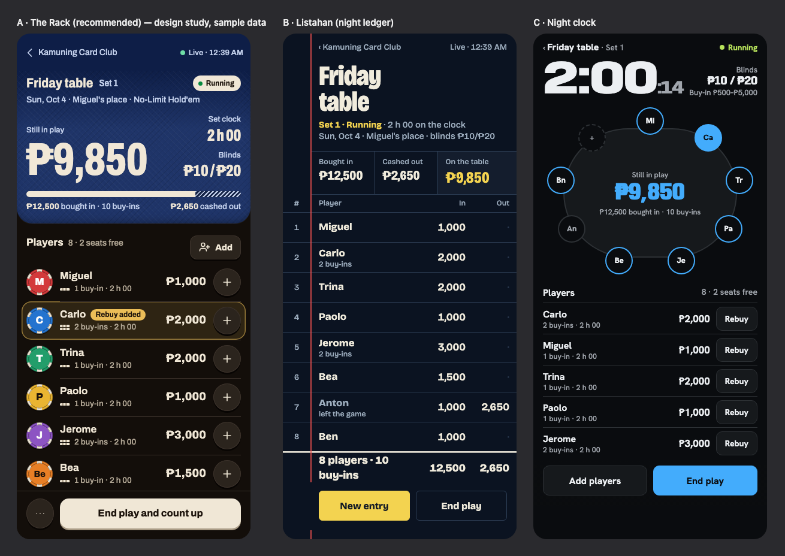
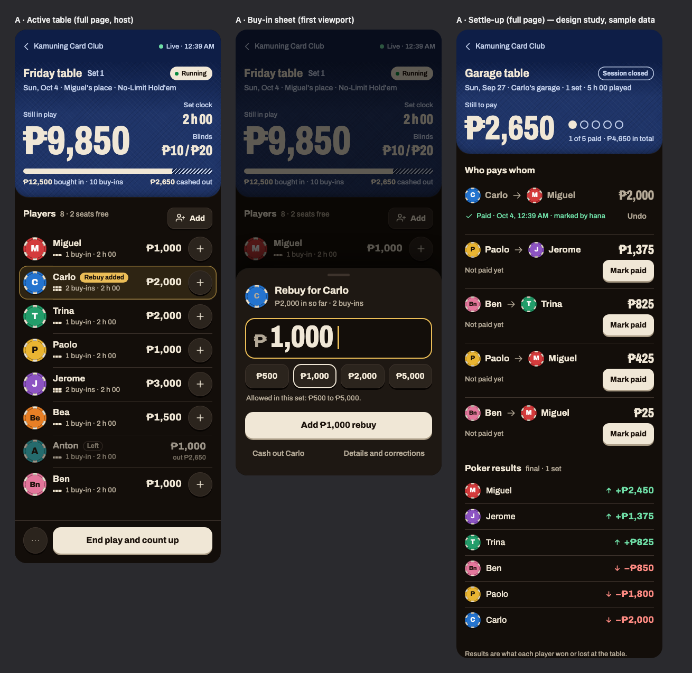
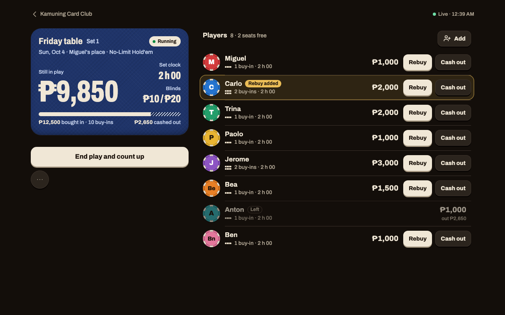

# Study: visual redesign

- **Date:** 2026-10-04 (Asia/Manila), Unix timestamp `1791045491`
- **Request:** a substantial visual redesign. A distinctive identity, stronger composition and purposeful motion. The app must stay easy to operate during a real game.
- **Workflow:** `agentic-workflow`, Phase 1 of a new cycle. No production UI changes before approval of the plan.
- **Skills applied:** `agentic-workflow` (process), `skill-router` (selection), Impeccable 4.3.1 (design): `critique`, `shape`, `new-work`, `operate`, `bolder`, `typeset`, `layout`, `animate`, `delight`.
- **Assets:** [1791045491_visual_redesign_assets/](1791045491_visual_redesign_assets/). Screenshots of the current app and rendered design studies. These are not production files.

Labels: **FACT** = verified today. **REC** = recommendation. **ASSUMED** = needs confirmation.

## 1. Tools and limits (FACT)

| Item | Result |
|---|---|
| Impeccable skill | Found at the given Codex path. `impeccable context` ran. It reports no `PRODUCT.md` and no `DESIGN.md` |
| Impeccable in Claude Code | Also installed as a plugin. Its review and documenter agents are available for Phase 2 |
| Impeccable direction roll (`concept-seed`) | **Did not run.** It refuses to run without `PRODUCT.md`. Writing `PRODUCT.md` is a project change, so it waits for approval. The plan makes it the first task |
| Impeccable interview (`init`, `shape`) | Not run as a separate question round. Your request is a precise brief. The open decisions are at the top of the plan |
| Impeccable critique with two sub-agents | **Degraded: single context.** I did the design review myself from screenshots, then ran the detector. No sub-agents were started in Phase 1 |
| Impeccable detector | `impeccable detect --json templates` returned no findings. It could not read the stylesheet through Django's `` tag, so colour rules were not checked |
| Browser tool | No built-in browser tool in this session. I used headless Chrome through the DevTools protocol (the method of the earlier cycles) |
| Image generation, Product Design plugin | The `product-design` Codex plugin exists on disk, but its tools are not available in Claude Code. No image-generation tool is available. **Alternative used:** real HTML and CSS mockups, rendered to PNG by Chrome |
| Impeccable update | A newer Impeccable (v4.5.0) is available. Update now? It runs `npx impeccable update`. Not run |

## 2. What exists and what does not (FACT)

Stack, verified in the repository: Django 6.1 templates (25 files, 940 lines), one stylesheet (`static/css/app.css`, 143 lines), four vanilla JavaScript files (245 lines). No front-end framework. No build step. This stays.

| Feature in the request | State in the app |
|---|---|
| Blinds, buy-in limits, unit (pesos or chips) | Implemented. "Chip values" do not exist: an owner decision removed chip-to-peso conversion |
| Table membership, joining, adding players | Implemented |
| **Seating and seat draw** | **Not implemented** (roadmap Stage 4) |
| Buy-ins, rebuys, reversals | Implemented |
| Live totals with polling | Implemented (`live.js`, every 4 s) |
| Early cash-outs, final counts, balance check, override | Implemented |
| Settle-up and paid marks | Implemented. One level only: the host marks a transfer paid. "Reported" versus "confirmed" payments do not exist |
| **Player statistics, leaderboards, charts** | **Not implemented** (roadmap Stage 3) |
| Game history | A "Past sessions" list on the group page. No history screen |

Consequence: the seat draw and the statistics screens can be **designed** in this cycle but not **built**. They need their features first, each with its own Phase 1.

## 3. Critique of the current UI

**Evidence:** the running app on a temporary database with seeded games (a live set, a set in count-up, a settled session), at 390 × 844 and 1280 × 800. I inspected these screens as rendered: login, home, group, set (setup, live, counting, finalized), session (live, settled), log, add players, new game, cash-out review. I did not inspect: invite acceptance, preset form, settings form (source only).

| Screen | Screenshot |
|---|---|
| Live set, phone | [phone_03_set_live.png](1791045491_visual_redesign_assets/current/phone_03_set_live.png) |
| Live set, desktop | [desk_03_set_live.png](1791045491_visual_redesign_assets/current/desk_03_set_live.png) |
| Count-up, phone | [phone_04_set_counting.png](1791045491_visual_redesign_assets/current/phone_04_set_counting.png) |
| Finalized set, phone | [phone_05_set_final.png](1791045491_visual_redesign_assets/current/phone_05_set_final.png) |
| Settle-up, phone | [phone_06_night_settled.png](1791045491_visual_redesign_assets/current/phone_06_night_settled.png) |
| Group, phone | [phone_02_group.png](1791045491_visual_redesign_assets/current/phone_02_group.png) |

**Verdict.** The interface is correct and readable. It has no identity: with the words removed, it could be any dark admin tool. The cause is structural, not a colour problem.

### Prioritized problems

| # | Problem | Evidence |
|---|---|---|
| P1 | **The main screen is a stack of identical forms.** Each player row shows two inputs, two buttons, a checkbox and a details link, all open | Live set with 8 players is 3,395 px tall on a phone: 4 screens. It has 8 "Rebuy" buttons with the primary colour and 8 "Cash out" buttons. Nothing leads |
| P2 | **No hierarchy among the figures.** Four equal tiles give "Players 8" the same weight as "Still in play ₱9,850". Blinds and the clock, which define the table, are the smallest text on the page | `.stat` grid; blinds line is 14 px muted |
| P3 | **No visual identity.** System font, one mint accent on green-black, and one component shape (a bordered 12 px card) for every purpose | `app.css`: one font stack, one radius, `.card` used 20+ times. Green-black plus one bright accent is also the default look for both "poker" and "dark dashboard" |
| P4 | **No feedback and no motion.** The stylesheet has no transition and no animation. A live update swaps the page region silently. A confirmed buy-in shows as a text banner at the top after a reload, far from the row | `grep` finds 0 `transition`/`animation` rules; `live.js` sets `innerHTML` |
| P5 | **Wrong action in the best position.** A host who has not joined sees a full-width primary "Join this game" above the totals. The actual frequent task, a rebuy, is below | Top of the live set screenshot |
| P6 | **Players look alike.** A name in plain text is the only way to find a person in a list, in a dim room | All list screens |
| P7 | **Desktop is the phone column in the centre.** 560 px of 1,280. The live set is 3,370 px tall on a desktop too | Desktop screenshot |
| P8 | **Settle-up is clear but flat.** The amount is not the largest element. Each unpaid row has a primary button. Progress ("1 of 5 paid") is one small badge | Settle-up screenshot |
| P9 | **The group page mixes six jobs in one scroll.** Sessions, past sessions, tables, presets, roster, invites. "Manage" repeats under each player | Group screenshot, 2,422 px tall |
| P10 | **Navigation is one text link.** The header holds the product name and "Log out". There is no sense of place | `base.html` |

What works and must stay: plain words, peso formatting, tabular figures, signs on results (`+₱2,450`, `−₱2,000`), 48 px touch targets, the focus ring, the balance check wording, the status labels in count-up, and the "Reconnecting…" line.

### Heuristic scores (Nielsen, 0–4)

| Heuristic | Score | Note |
|---|---|---|
| Visibility of system status | 2 | Live line exists. No feedback at the point of action |
| Match with the real world | 3 | Poker words are right |
| User control and freedom | 3 | Reversals, undo paid, resume play |
| Consistency and standards | 3 | Consistent, to the point of sameness |
| Error prevention | 3 | Review step before batch cash-out |
| Recognition, not recall | 2 | Players are text only. Limits are far from the input |
| Flexibility and efficiency | 2 | A rebuy needs a long scroll for players low in the list |
| Aesthetic and minimalist design | 1 | Every control is always visible |
| Error recovery | 3 | Messages name the player and the rule |
| Help and documentation | n/a | |

## 4. Design brief (Impeccable `shape`)

1. **Job and audience.** One host holds the bank for a physical cash game. They use a phone in one hand, between hands, in a dim room, often late. Players look at the same screen on their own phones to check totals and, later, what they owe. Visitor mode: **Operate**.
2. **Outcome.** A rebuy is recorded in two taps without scrolling the page into four screens. The money in play, the clock and the blinds read from arm's length. At the end, each person sees one amount and one name.
3. **Product truth.** Every peso that goes in must come out. The app is a banker's record, not a casino.
4. **Boundaries.** Routes, permissions, accounting, formatting, form fields and `request_id` handling stay. Django templates, CSS and vanilla JavaScript stay. No new runtime dependency.
5. **Anti-goals.** Card suits as decoration, gold gradients, neon, slot-machine effects, charts without a question to answer, motion that plays again on each refresh.

Physical scene (it decides the theme): a host at a table at 1 AM under one warm lamp, phone at arm's length. This forces a **dark** theme with warm, low-glare light tones. A light theme is out of scope.

## 5. Three directions

Rendered side by side at 390 × 844, first viewport, same data: [compare.png](1791045491_visual_redesign_assets/mock/compare.png)

### A. "The Rack" (contemporary card room)

- **Idea.** The objects of a home game: a chip rack, a felt surface, a dealer button. Each player is a **chip token** with a colour and an initial. Each buy-in is one chip edge in a small stack next to the name.
- **Composition.** One saturated field at the top (indigo speed-cloth, not green) holds the table state: money in play, clock, blinds, and a bar that splits "bought in" into "in play" and "cashed out". Below it, a quiet list on warm near-black. One bone-white primary button, shaped like a clay chip with a visible edge.
- **Type.** Archivo, one variable family. Its narrow, heavy cut sets the big amounts; its normal width sets the interface.
- **Signature interaction.** Tap `+` on a row. A sheet rises with the default amount and four quick amounts. Confirm. The row gains a chip edge and a brass highlight.
- **Risk.** It can slide into casino kitsch. The rule that prevents it: the chip token and the felt field are the only two "material" devices. No suits, no cards, no gold.

### B. "Listahan" (night ledger)

- **Idea.** The host's notebook. A ruled ledger with a red margin line, a row number for each player, "In" and "Out" columns, and a double rule under the totals.
- **Composition.** Dense. Eight players and the totals fit in one phone screen without any expansion. Large condensed title. Pencil-yellow for the one primary action.
- **Type.** Bricolage Grotesque.
- **Signature interaction.** A new entry is "inked" into its row. When the books balance, the double rule draws under the totals.
- **Risk.** It is the most truthful to the product and the least tactile. It reads as accounting software. Row actions are hidden: a row gives no sign that it can be tapped. The narrow columns leave little room for status labels in count-up.

### C. "Night clock" (session dashboard)

- **Idea.** A tournament clock. A very large timer, and an oval table diagram with a ring of seats.
- **Composition.** Clock, then the oval with the money in play at its centre, then a compact list. One electric blue.
- **Type.** Anybody (wide numerals) with Hanken Grotesk.
- **Signature interaction.** Tap a seat to act on that player.
- **Risk.** The oval implies seat positions that the app does not have (seating is Stage 4). It takes 270 px and repeats the list below it. A cash game has no blind levels, so the giant clock answers a question that few people ask. Near-black with one bright accent is the look that most dark dashboards share.

### Recommendation (REC): direction A, with two loans

| Criterion | A. The Rack | B. Listahan | C. Night clock |
|---|---|---|---|
| Tactile, tied to a real poker night | Strong | Medium | Weak |
| Distinctive | Strong | Strong | Medium |
| Speed of a rebuy on a phone | 2 taps, target visible | 2 taps, target not visible | 1 tap, small targets |
| Finds a player quickly in a dim room | Colour and initial | Row number | Seat position (not real yet) |
| True to today's features | Yes | Yes | No (needs seating) |
| Carries to seat draw, settlement, statistics | Token is reused everywhere | Tables only | Seat ring only |

A is recommended because the chip token is one device that works on every surface: the list, the transfer rows ("token → token"), a later seat draw, and later charts. It also fixes P6.

Loans, taken as discipline and not as decoration:

- **From B:** one right-aligned column of tabular figures on every list, and the "books balance" moment in count-up.
- **From C:** the clock and blinds stay in the top field, and host actions stay in a fixed bar at the thumb.

**Status: proposed.** You select or change the direction when you answer the plan.

## 6. Visual studies of the recommended direction

Rendered HTML and CSS, not production code. Sample data is seeded, not real results.

Active table (full page), buy-in sheet, settle-up, at 390 px: [rack_flow.png](1791045491_visual_redesign_assets/mock/rack_flow.png)

Active table at 1,280 px: [rack_desktop.png](1791045491_visual_redesign_assets/mock/rack_desktop.png)

Measured result: the live set with 8 players is about 1,000 px tall instead of 3,395 px. The sources are in [mock/](1791045491_visual_redesign_assets/mock/) (`a_table.html`, `a_settle.html`, `rack.css`).

Known gaps in the studies: no count-up screen, no group screen, no error or empty state. Section 9 specifies them in words. They are not rendered.

## 7. Proposed design system (direction A)

### Typography

One family: **Archivo** (variable: width 62–125, weight 100–900; SIL Open Font License). Verified in Chrome: it has `₱` and `−`. It has no arrow glyphs, so arrows are icons. The font file is self-hosted in `static/fonts/`. System UI is the fallback.

| Role | Setting | Use |
|---|---|---|
| Display amount | width 70, weight 800, 56–76 px, tabular | The one main figure of a screen |
| Side figure | width 70, weight 800, 27 px | Clock, blinds |
| Title | width 88, weight 700, 22 px | Table or session name |
| Section | weight 700, 17 px | "Players", "Who pays whom" |
| Row name | weight 650, 17 px | Player names |
| Row amount | weight 750, 19 px, tabular | Per-player figures |
| Body | weight 500, 16 px | Text, inputs (16 px stops iOS zoom) |
| Meta | weight 500, 13.5 px | Counts, times, hints |
| Tag | weight 700, 12–13 px | Status labels |

Sizes are fixed, not fluid. Browser zoom and text scaling keep working because sizes are in `rem`.

### Colour (OKLCH, dark only)

| Token | Value | Use |
|---|---|---|
| `--ground` | `oklch(0.17 0.012 60)` | Page. Warm near-black |
| `--rail`, `--rail-2` | `oklch(0.215 0.014 60)`, `oklch(0.265 0.016 60)` | Sheet, secondary buttons |
| `--line` | `oklch(0.33 0.018 60)` | Row rules |
| `--bone`, `--bone-dim` | `oklch(0.93 0.025 85)`, `oklch(0.74 0.028 80)` | Text, primary button fill; secondary text |
| `--felt`, `--felt-deep`, `--felt-ink` | `oklch(0.34 0.095 265)`, `oklch(0.25 0.08 265)`, `oklch(0.86 0.04 265)` | The top field and its secondary text |
| `--brass` | `oklch(0.82 0.13 85)` | Focus ring, pending and "just changed" |
| `--up`, `--down` | `oklch(0.82 0.13 160)`, `oklch(0.76 0.14 25)` | Won, lost. Always with a sign and an arrow icon |
| `--c1` … `--c10` | Ten chip colours | Player tokens only |

Rules: the felt field is the only large colour area. The primary action is bone, not a hue, so it never competes with won/lost colours. Brass means "attention" and nothing else. The felt colour changes with the set state: indigo while open or running, a muted slate when counting up, finalized or canceled. A text label always states the state too.

Contrast target: 4.5:1 for text, 3:1 for large figures and control edges. Phase 2 measures this; it is not measured yet.

### Space, shape, depth

- Spacing scale (4 px base): 4, 8, 12, 16, 20, 28, 40.
- Radii: 12 (small controls), 15 (buttons), 16 (rows), 26 (felt field, sheets), full (tokens, tags).
- Depth has two uses only. A pressable control has a 3 px solid edge below it, which goes to 0 when pressed. A sheet has one soft shadow. No glow and no glass.
- Texture: a fine diagonal weave on the felt field, made with CSS gradients. No image files.

### Components

| Component | Notes |
|---|---|
| App bar | Back link with the parent's name, live status at the right. The user menu (name, log out) moves into a menu at the top level screens |
| Felt field | Title, state tag, one display amount, up to two side figures, optional split bar |
| Split bar | "Bought in" as the full width; "in play" solid, "cashed out" hatched. It keeps total buy-ins and money in play distinct |
| Chip token | 44 px and 30 px. Colour from the player's join order in the set. Initial; two letters when two players share an initial. Colour is never the only cue |
| Buy-in stack | One chip edge per accepted buy-in, up to 5, then "+n". Decorative for screen readers; the text states the count |
| Player row | Token, name, meta, amount, one action |
| Button | Primary (bone), secondary, quiet, danger, round icon button. States: default, hover, focus, pressed, disabled, pending |
| Sheet | A native `<dialog>` from the bottom on a phone, centred on a desktop. Closes with the close button, Escape, or the backdrop |
| Amount field | Large figure, currency sign prefix, quick amounts (minimum, default, 2 × default, maximum of the set) |
| Tag | State and status labels. Outline for neutral, filled for active |
| Toast | Replaces the top banner for success messages. Errors stay inline at the field and in a banner |
| Transfer row | Payer token → payee token, amount, state line, one action |
| Result row | Token, name, arrow icon, signed amount |
| Dock | Fixed bar at the bottom with the next host action |

Icons: about 10 inline SVG line icons from one set, 2 px stroke, drawn in the template. No icon font and no library. Proposed source: Lucide (ISC licence), copied as SVG paths.

### Responsive behaviour

- Under 900 px: one column. Felt field, list, dock.
- 900 px and wider: two columns. The felt field and host actions stay fixed at the left (400 px). The list is at the right, and each row shows its actions as buttons instead of one `+`.
- The sheet becomes a centred dialog, 420 px wide.

## 8. Motion specification

Principles: motion reports a state change or keeps continuity. Nothing loops. Nothing plays on a refresh unless a value changed. The true amount appears at once; only its surroundings animate.

Tokens: `--t-press: 110ms`, `--t-fast: 180ms`, `--t-sheet: 320ms`, `--t-focal: 600ms`. Easing: `--ease-out: cubic-bezier(0.16, 1, 0.3, 1)` for arrivals, `--ease-in: cubic-bezier(0.4, 0, 1, 1)` for exits. Exits are faster than entrances.

| # | Animation | Trigger | Purpose | Element | Duration, easing | Interruption | Reduced motion |
|---|---|---|---|---|---|---|---|
| M1 | Press | Pointer down on a button | Acknowledge the touch | Button moves 3 px down onto its edge | 110 ms, ease-out | Reverses on release | Background tone change only |
| M2 | Sheet open | Tap `+`, "Cash out", "More" | Show where the form came from | `<dialog>` slides up 24 px and fades; backdrop fades | 320 ms, ease-out | A second tap or Escape starts the close from the current position | Fade only, 120 ms |
| M3 | Sheet close | Close, Escape, backdrop | Return to the list | Reverse of M2 | 200 ms, ease-in | Reopen starts from the current position | Fade only |
| M4 | Pending | Submit of any form | Show that the request is on its way | Button label changes to "Sending…", button is disabled, a 2 px bar runs along its bottom edge | Until the response; the bar is one 900 ms sweep that repeats only while pending | Ends when the page responds | Label change only |
| M5 | Confirmed change | The page loads or the live region refreshes, and a watched value differs from the last one this browser saw | Point to what changed, after the server confirmed it | Row gets a brass ring and tint, which fade out. The amount itself is already the final value | Ring in 180 ms, hold 1.2 s, out 600 ms | A newer change on the same row restarts the hold | Ring appears and disappears with no fade; a "Rebuy added" tag shows for 3 s |
| M6 | New buy-in edge | Same check as M5, when the buy-in count rose | Make the stack readable as "one more" | The new chip edge drops 8 px onto the stack | 320 ms, ease-out | None needed | Edge is simply present |
| M7 | Total changed | Same check as M5, on the display amount | Draw the eye to the pot | A brass underline draws under the figure and fades | 600 ms total | Restarts | Underline shows for 1.5 s, no drawing |
| M8 | Page transition | Navigation between screens | Continuity | Cross-document View Transition: 180 ms cross-fade. The felt field keeps its place when both pages have one | 180 ms | The browser handles it | Off |
| M9 | State change | The set moves to running, count-up or finalized | Mark a new phase | The felt colour and the state tag cross-fade | 600 ms | Not interruptible, not blocking | Instant |
| M10 | Marked paid | The server confirms a paid mark | Closure | The progress dot fills, the row's amount dims, a check icon draws | 320 ms | Undo reverses with M3 timing | Instant state, check icon static |
| M11 | Books balance | Count-up: the difference reaches zero | The one celebration of an accounting task | A double rule draws under the two totals and the text "The books balance" appears | 600 ms, once per set per browser | None | Rule is simply present |
| M12 | Toast | A success message exists on page load | Confirm without moving the layout | Toast rises 12 px at the bottom, stays 4 s, leaves | 180 ms in, 180 ms out | Tap closes it; hover or focus pauses it | No movement; stays until closed or 6 s |
| M13 | Stale connection | Two failed polls | Warn that figures can be old | The live dot turns brass and the label reads "Reconnecting… last updated 12:39". Figures dim to 70% | 180 ms | Recovers on the next good poll | Same, no fade |
| M14 | Session recap | The session page loads the first time after it was closed | A short end to the night | A sheet lists: time played, money through the table, the biggest win, and the viewer's own result. Four lines appear in a 60 ms stagger | 600 ms total. Closes with one tap. Shown once per session per browser | Any tap or key closes it | No stagger; the sheet opens static. It is never shown again after it is closed |
| M15 | Seat draw (**specification only; needs Stage 4**) | The host confirms a draw; the server saves the seats; the page loads the saved result | Reveal the saved arrangement | Chip tokens start in a row and move to their numbered seats, one each 120 ms | About 1.6 s for 9 seats. A "Skip" control shows from the start | Skip, a tap, or a reload shows the final arrangement at once. The animation never asks the server for a new draw | No movement. The numbered list is shown |
| M16 | Chart reveal (**specification only; needs Stage 3**) | A chart scrolls into view the first time | Lead the eye along the series | Bars grow from the zero line; values are printed as text at once | 320 ms, once | None | Static chart |
| M17 | Leaderboard order (**rule only; needs Stage 3**) | New results arrive | Avoid a moving target | Rows do not reorder while a pointer or focus is inside the list. A "New results. Update order" control appears instead | — | — | Same |

Rules for the live refresh (they answer P4 without new problems):

- Elements carry `data-watch="<key>"`. The script compares each value with the last value stored for that key in `sessionStorage`. Only a difference triggers M5, M6 or M7. A refresh with the same values triggers nothing.
- No element has an entrance animation by default. Content is visible without JavaScript and without animation.
- The focused control is never replaced. The existing rule stays: a refresh waits while a field has focus, and typed values are restored.
- An open sheet is outside the live region, so a refresh does not close it.
- No sound. No flashing. No animation that runs longer than 1.6 s. Only `transform` and `opacity` animate, except colour fades.

Tools: CSS transitions, `@starting-style`, cross-document View Transitions, and a few lines of vanilla JavaScript for the change check. **No animation library.** Where a browser lacks a feature, the result is the same screen without that transition.

## 9. Screen-by-screen scope

### Shared foundation

Tokens, font, base elements, buttons, fields, tags, lists, messages and toasts, app bar, felt field, chip token, sheet, dock, motion tokens, change check. Because every template uses the shared classes, each screen moves to the new look at this step, before its own recomposition.

### Screens

| Screen | Change | Features needed |
|---|---|---|
| **Active table** (set page: open, running) | Felt field with the pot, clock, blinds and split bar. Token rows. `+` opens the buy-in sheet. Cash-out, details and corrections move into the player sheet. Host dock. "Join this game" becomes a row-level action at the top of the list, not a full-width banner | Exists |
| **Buy-in** | Sheet with amount field and quick amounts. Pending state, then M5 and M6 on return | Exists |
| **Count-up** (set page: reconciliation) | Felt field shows "Counted ₱x of ₱y" as the display figure and the difference with its direction. Rows keep an always-visible count field (the bug fix of the last cycle stays: one form, values kept). Status tags. "Books balance" moment (M11). Dock: "Cash out counted players (N)" | Exists |
| **Cash-out review** | Review table with tokens and one total | Exists |
| **Finalized set** | Slate felt, "Final" tag, result rows. Live-only figures stay hidden | Exists |
| **Settle-up** (session page, closed) | Felt field with "Still to pay" and progress dots. Transfer rows. Result rows. Payment records as a quiet log. Recap sheet (M14) | Exists |
| **Session page, open** | Set list with state tags and timers, "Start next set" in the dock | Exists |
| **Group** | Sessions first, as rows with state tags. Tables, presets, roster and invites move behind a "Manage group" section with sub-headings. Roster rows with tokens | Exists |
| **Home, login, sign-up, invite** | Felt field as a small masthead. Forms in the new field style | Exists |
| **Forms** (new game, preset, settings, add players) | New field, hint and error styles. Sticky confirm bar becomes the dock | Exists |
| **Log** | Time column in tabular figures, reversed entries struck through with the reason | Exists |
| **Seat draw** | Specified in M15. Not built | Stage 4 |
| **History, statistics, leaderboards** | Chart style: bars and lines in the chip colours on the ground colour, each value printed as text, no chart without a stated question. Not built | Stage 3 |

### States

| State | Design |
|---|---|
| Empty | A sentence that states the next step and one button. Example: "No players yet. Add players to start buy-ins." No illustration |
| Loading or pending | M4. No spinner in the content. No skeleton, because pages render on the server |
| Validation error | The message sits at the field, in `--down` with an alert icon, and the field has a 2 px edge in the same colour. The typed value stays. The sheet reopens with the error after a refused submit |
| Disconnected or stale | M13 |
| Provisional versus final | Live figures carry no tag. Results before finalization do not exist on screen. Finalized results carry a "Final" tag and the slate felt. A set in count-up shows "Counting up" and never shows a result figure |
| Poker result versus payment | Two sections with different rows: result rows have an arrow and a sign; transfer rows have two tokens and a state line. A footnote states the difference in one sentence |
| Chips game | The same layout. Amounts read "9,850 chips"; the display figure sets the word "chips" at meta size |

## 10. Proposed content for `PRODUCT.md` (not written yet)

Impeccable needs `PRODUCT.md` before its direction roll and its review. Phase 2 writes it from this text:

- **Product.** PokerNights records buy-ins and cash-outs for home poker cash games, checks that the books balance, and calculates who pays whom. It does not move money.
- **Users.** A host who runs the bank on a phone during the game. Players who check totals and what they owe. A private group of friends in the Philippines.
- **Scene.** A dim room, late, one hand free, short glances between hands.
- **Voice.** Plain, short, exact about money. No hype, no gambling slang beyond the game's own terms.
- **Brand commitments.** Dark theme. Pesos formatted as `₱1,600`. Win and loss never by colour alone. No casino imagery.
- **Constraints.** Django templates, CSS, vanilla JavaScript. No framework. Single column on phones. Large touch targets.

## 11. External inputs

| Input | Source | State |
|---|---|---|
| Archivo variable font | The Archivo project (SIL Open Font License) | To download in Phase 2 and store in `static/fonts/` with its licence file. This is a static asset, not a package |
| About 10 icons | Lucide (ISC licence), copied as inline SVG | To copy in Phase 2 |

No package, CDN link or build tool is added. The mockups load the font from Google Fonts; production does not.

## 12. Risks

| Risk | Mitigation |
|---|---|
| A template change breaks a form, a route or the live refresh | 368 existing tests stay green. The forms keep their fields, actions and `request_id`. The earlier browser checks are rerun on the new markup |
| The sheet hides an action that was one tap before | The `+` on each row opens the sheet with the default amount, so a default rebuy is two taps. Without JavaScript, each row keeps an inline `
` with the same forms |
| The sheet and the live refresh conflict | The sheet lives outside the live region and reads the row's data when it opens |
| Chip colours do not separate for colour-blind users | The initial is the identity. Colour is a second cue |
| The style reads as a casino | Two material devices only. Reviewed in the bounded visual round |
| Font loading shifts the layout | `font-display: swap` with a size-adjusted fallback; one file, preloaded |
| Endless polish | One review round at phone and desktop width together, one batch of fixes, one confirmation round |

## 13. Open questions

They are in the plan, at the top.
